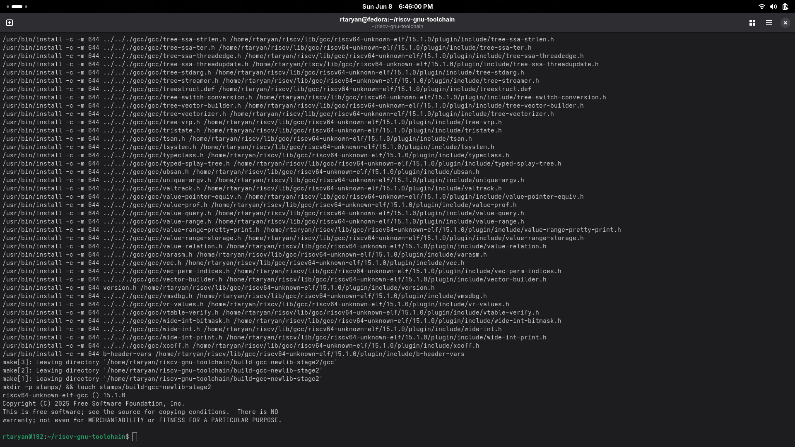
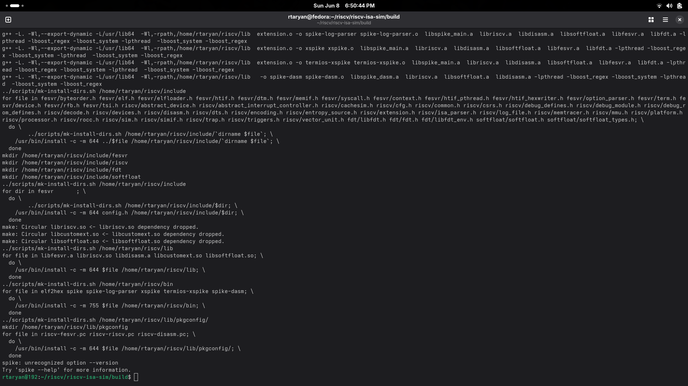
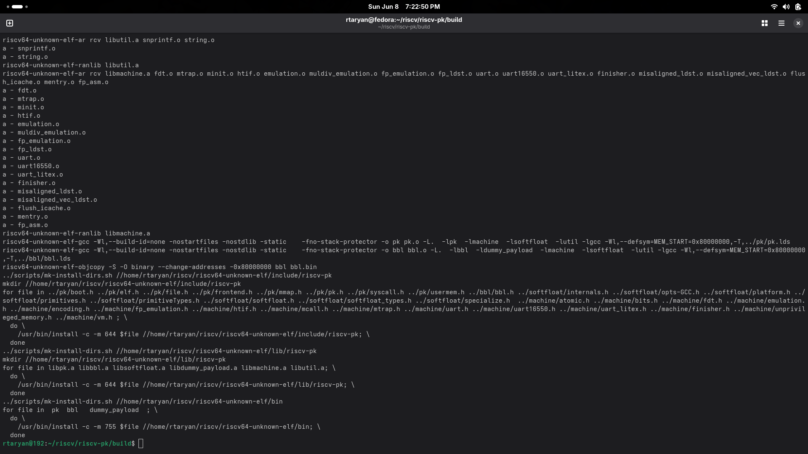
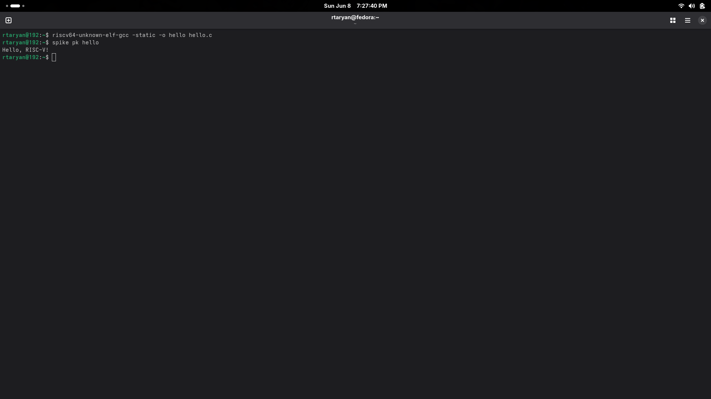

# India RISC-V Chip Tapeout Project

Welcome to the **India RISC-V Chip Tapeout** project!  
This project focuses on a full-chip RISC-V processor design and tapeout, exploring new implementation flows using Synopsys tools.

---

## Project Overview

- Full chip design and tapeout of a RISC-V processor  
- Using Synopsys EDA tools for synthesis, place & route, and signoff  
- Running and testing RISC-V software on Spike simulator and Proxy Kernel
- **All development and testing performed on Linux Fedora environment**
---

## Complete Setup and Build Instructions

### 1. Install RISC-V GNU Toolchain

```bash
git clone https://github.com/riscv/riscv-gnu-toolchain.git
cd riscv-gnu-toolchain

./configure --prefix=$HOME/riscv --with-arch=rv64gc --with-abi=lp64d
make -j$(nproc)

export PATH=$HOME/riscv/bin:$PATH
riscv64-unknown-elf-gcc --version
```


### 2. Install Spike Simulator
```bash
cd $HOME/riscv
git clone https://github.com/riscv-software-src/riscv-isa-sim.git
cd riscv-isa-sim
mkdir build
cd build

../configure --prefix=$HOME/riscv
make -j$(nproc)
make install

export PATH=$HOME/riscv/bin:$PATH
spike --version
```


### 3. Build proxy kernel (riscv-pk)
```bash
cd $HOME/riscv
git clone https://github.com/riscv-software-src/riscv-pk.git
cd riscv-pk
mkdir build
cd build

../configure --prefix=$HOME/riscv --host=riscv64-unknown-elf
make -j$(nproc)
make install
```


### 4. Compile and Run RISC-V Software Example

Create a simple hello.c program:
```c
#include <stdio.h>

int main() {
    printf("Hello, RISC-V World!\n");
    return 0;
}
```
Compile and link:
```bash
riscv64-unknown-elf-gcc -static -o hello hello.c
```
Run on Spike Simulator
```bash
spike pk hello
```


Thank you for exploring the India RISC-V Chip Tapeout project!
